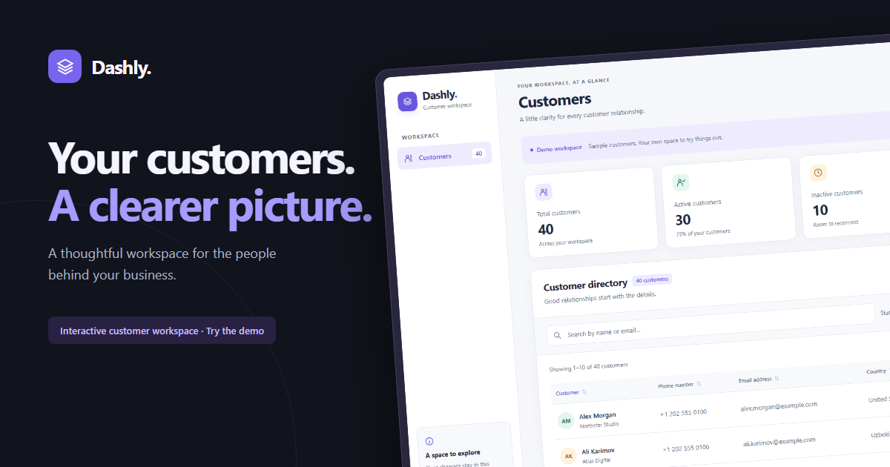
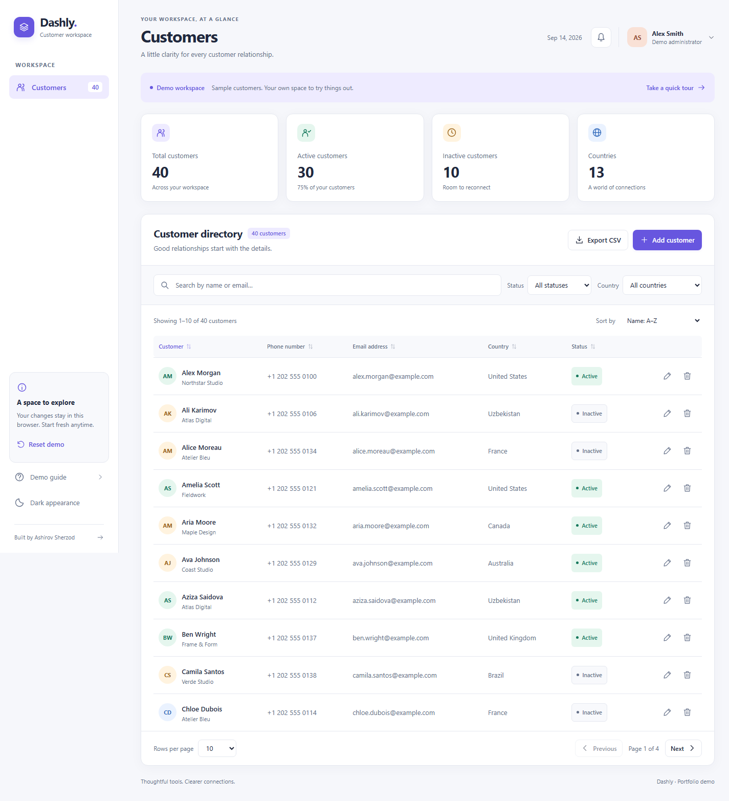
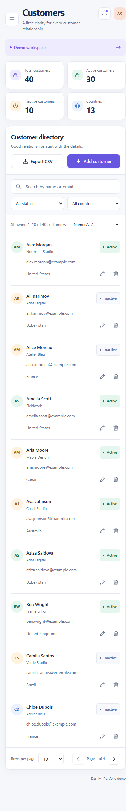
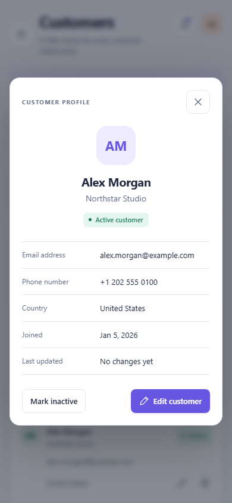
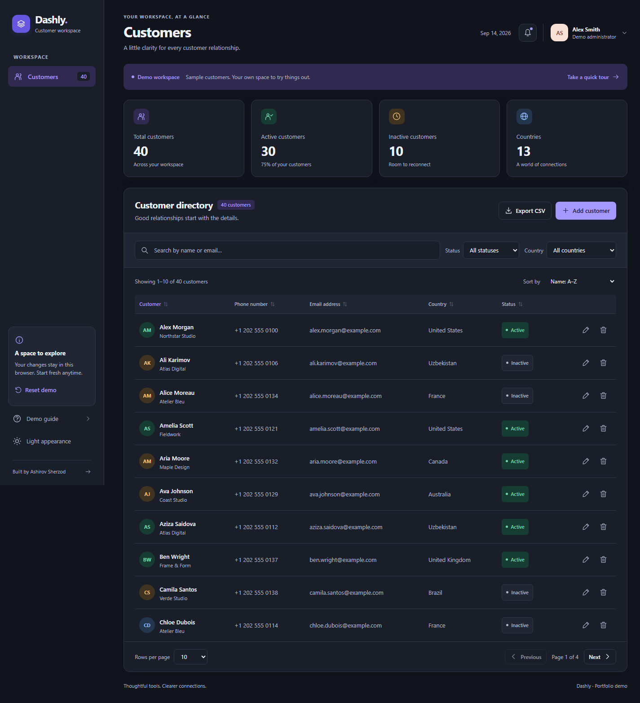
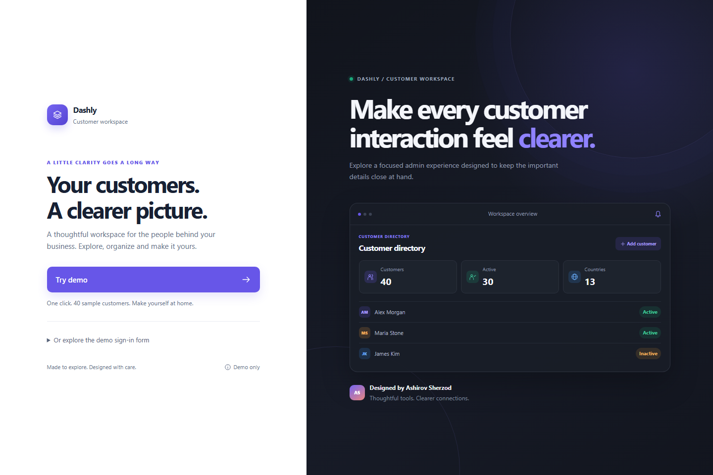

# Dashly — Customer workspace

A thoughtful customer directory built with HTML, CSS and JavaScript. Explore a complete workflow: find a customer, open their profile, update their details, change their status and export the results.

[Open the demo](https://dashboard-js-7le5.vercel.app/) · [Source code](https://github.com/AshirovSherzod/dashboard-js)



## Explore the demo

Choose **Try demo** on the welcome page. Your browser starts with **40 fictional customers across 13 countries**, including 30 active customers.

- Search by name or email; combine status and country filters.
- Sort by customer, email, phone, country, status or join date.
- Move between pages with 10, 20 or 50 rows per page.
- Open a customer profile with company, contact details and dates.
- Add, edit and delete customers; toggle active status.
- Export all matching customers as CSV, across every result page.
- Switch between light and dark appearance.
- Use the in-app demo guide and view your actual recent activity.
- Select **Reset demo** to restore the original samples.
- Select **Exit demo** to return to the welcome page without clearing your work.

The optional sign-in form also accepts `admin@gmail.com` / `administhebest3467`. It is a demo interaction, not authentication.

## Screenshots

<details>
<summary>Desktop directory</summary>



</details>

<details>
<summary>Mobile directory and customer profile</summary>




</details>

<details>
<summary>Dark appearance and welcome page</summary>




</details>

## Run locally

Requires Node.js 22 or newer. No package installation is needed.

```bash
git clone https://github.com/AshirovSherzod/dashboard-js.git
cd dashboard-js
npm start
```

Open [localhost:5500](http://localhost:5500). On Windows PowerShell, use `npm.cmd` if the execution policy blocks `npm.ps1`.

Python is also supported:

```bash
python -m http.server 5500
```

Serve the project over HTTP; opening `index.html` as a local file will not load JavaScript modules correctly.

## Data and persistence

`js/seed.js` provides a deterministic sample directory. `js/api.js` manages the demo in the versioned `dashly.customers.v1` localStorage key. Changes are isolated to a browser and origin; tabs in the same browser share the directory and receive storage updates. There are no requests to a public customer API.

The app recovers unreadable saved data with fresh samples and a visible notice. If storage is blocked or full, it keeps the workspace usable in memory and explains that changes will last only for that visit. Theme and page-size preferences are stored separately.

All sample people are fictional, email addresses use the reserved `example.com` domain, and phone numbers are demonstration values. Use sample information in this frontend demo.

## Interface details

- Global statistics remain stable when a search or filter changes.
- New customers appear immediately at the top of the directory.
- Forms validate trimmed names and countries, phone formats and duplicate emails.
- Native modal dialogs contain keyboard focus, support Escape and scroll on short screens.
- Mobile customer cards keep status and edit/delete actions visible without sideways scrolling.
- Hidden mobile navigation is removed from keyboard interaction and closes with Escape.
- Local SVG icons and system fonts remove external runtime dependencies.
- Reduced-motion preferences are respected.
- Customer content is inserted as text. CSV cells escape quotes and neutralize spreadsheet formulas.

## Project structure

```text
assets/                 Local icons, screenshots and social preview
css/base.css            Shared theme tokens and accessibility styles
css/style.css           Welcome page
css/dashboard.css       Directory, cards, dialogs and responsive layouts
js/seed.js              40 fictional sample customers
js/api.js               Persistent demo CRUD and recent activity
js/customers.js         Filtering, sorting, pagination, validation and CSV
js/dashboard.js         Directory state and user interactions
js/script.js            One-click entry and optional demo sign-in
js/ui.js                Shared icons, preferences and display helpers
js/theme.js             Theme initialization before first paint
pages/dashboard.html    Customer workspace
scripts/                Local server, static build and browser checks
tests/                  Node tests for customer logic and persistence
```

## Validation

```bash
npm test
npm run test:browser
npm run build
```

The browser checks use an isolated Chrome/Chromium profile through the Chrome DevTools Protocol. Set `CHROME_PATH` if the browser is installed outside the usual locations. They cover login, CRUD, persistence, filters, sorting, pagination, CSV download, reset, keyboard navigation, small viewports and theme switching, and verify that the app makes no external runtime requests.

The browser command refreshes the screenshots in `assets/images/` and writes a local report to `.cache/browser-report.json`. On restricted test machines where Chrome's sandbox cannot start, `DASHLY_CHROME_NO_SANDBOX=1` enables the isolated headless test profile.

## Deployment

`npm run build` copies only the public application files into `dist/`. The committed screenshots let builds run without a browser. `vercel.json` configures Vercel to build and serve that directory. The same output can be served by any static host.

The existing Vercel project is linked to this repository. A push to a feature branch creates a preview deployment; the project's production branch controls the public demo. See [Vercel project configuration](https://vercel.com/docs/project-configuration) for the build and output settings.

Vercel builds use the deployment's `VERCEL_URL` for absolute social-preview and canonical URLs. Set `SITE_URL` to an HTTPS deployment URL to override it or build for another host. This project has no backend, secret environment variables or paid runtime dependencies.
